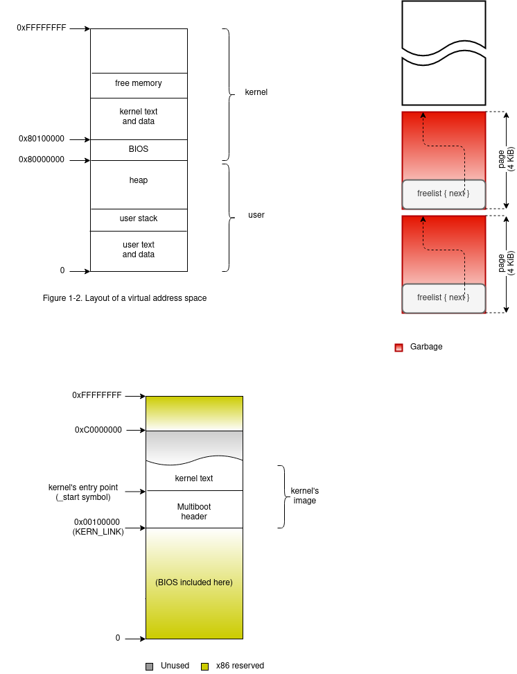

# brunix (stage 0)
##### *** Small Unix-like 32-bits x86 OS for fun and learning ***

### =>>> Multiboot-compliant executable <<<=

If you didn't yet, please read the main [README.md](https://github.com/bruno-masci/brunix/blob/master/README.md) 
document first, and specially the [Pre-requisites](https://github.com/bruno-masci/brunix/tree/master#-pre-requisites).

## # Goals

For now, we'll just create a bootable ELF executable and check it is a valid Multiboot-compliant executable.\
In order to achieve that, we need to add the Multiboot header at the beginning of the executable and set the desired entry point where the control is transferred to by the bootloader.

## # Project building 

(Please complement this section by looking at the "CMakeLists.txt" file)

### Image building and validation

(The *$* symbol indicates the shell prompt)

To build the image, we must run:

	build$ make

and expect to see something like:
[output:]\

    [100%] Built target brunix.elf

Then, we can check the expected 32-bit executable was created:

    build$ file brunix.elf 
[output:]\
*brunix.elf: __ELF 32-bit LSB executable__, __Intel 80386__, version 1 (SYSV), __statically linked__, not stripped*

### Building internals

Our cross-compiler is set as follows:

    CROSS_COMPILER_BIN_PATH:  /home/osdev/opt/cross/bin
    CMAKE_C_COMPILER:         ${CROSS_COMPILER_BIN_PATH}/i686-elf-gcc
    CMAKE_ASM_COMPILER:       ${CMAKE_C_COMPILER}
    

When we fire the image generation process, *GCC* compiles all C and ASM source code into [relocatable ELF object files](http://wiki.osdev.org/Object_Files) that
are linked together, using *LD*, into a statically-linked ELF executable file:

    CMAKE_LINKER:             ${CROSS_COMPILER_BIN_PATH}/i686-elf-ld
    CMAKE_EXE_LINKER_FLAGS:   ${LDFLAGS} -Wl,-Map,System.map
    CMAKE_C_LINK_EXECUTABLE:  ${CMAKE_C_COMPILER} <CMAKE_C_LINK_FLAGS> <LINK_FLAGS> -o <TARGET> <OBJECTS> -lgcc

The "-Map,System.map" option creates a file called "System.map" containing all the symbols from the object files.\
Regarding the "-lgcc" library inclusion, see [Libgcc](https://wiki.osdev.org/Libgcc).

## x86 memory types

On an x86 PC we have two kind of addresses: [virtual/logical and physical](https://www.geeksforgeeks.org/logical-and-physical-address-in-operating-system/)
(assume virtual and logical is the same here).\
Virtual addresses are the ones a program uses. A program cannot directly access a physical address!\
Physical addresses are the ones that can be accessed by the hardware, like RAM memory, devices, BIOS, and so on.

On the one hand, an x86 machine has a 32-bit CPU and so it can address up to 4 GiB of *virtual* address.\
On the other hand, there is a physical address space that doesn't need to be the same size as the virtual address space. 
It includes the RAM memory but also memory-mapped devices, the BIOS routines and hardwired addresses like the one used 
for booting up the computer.

The x86 CPU only knows about virtual addresses (don't confuse it with [virtual memory](https://en.wikipedia.org/wiki/Virtual_memory)),
so no program (even the kernel) can directly access a physical address.\
XXX
XXXX
XXXXX

## How do pieces play together?

The [x86 memory model](https://wiki.osdev.org/Memory_Map_(x86)) reserves some physical memory regions for special uses
(physical memory is *not* the same as RAM memory).\
The region that starts at 0xC0000000 (3 GiB) contains some memory-mapped devices.\
The region that extends through the first MiB of physical memory does contain the BIOS routines, the memory-mapped video 
display, etc. It also contains some free memory slots we choose to ignore for simplicity. Let's place the kernel 
at 1 MiB, instead. But... 1 MiB of what?

### Linker's VIRTUAL vs LOAD address

The linker differentiates between the address a given section runs at (the virtual address) and the address that section
is loaded -or programmed, or flashed- at (the load address).\
For now let both addresses to match, so the kernel "think" it runs at 1 MiB virtual address and the bootloader loads the 
kernel's image at 1 MiB of physical memory. In later stages we will benefit from this feature while switching to a more
flexible memory layout.

[Figure: Kernel physical memory layout]

## BLE

    /home/osdev/opt/cross/bin$ i686-elf-objdump -x brunix.elf 
[partial output:]
    
    start address 0x00101000
    
    Program Header:
        LOAD off    0x00000054 vaddr 0x00100000 paddr 0x00100000 align 2**2
    
    Sections:
    Idx Name          Size      VMA       LMA       File off  Algn
      0 .boot         0000000c  00100000  00100000  00000054  2**2
                      CONTENTS, ALLOC, LOAD, READONLY, DATA
      1 .text         00000005  00101000  00101000  00001054  2**0
                      CONTENTS, ALLOC, LOAD, READONLY, CODE
    SYMBOL TABLE:
    00100000 l    d  .boot	00000000 .boot
    00101000 l    d  .text	00000000 .text
    00000000 l    df *ABS*	00000000 CMakeFiles/brunix.elf.dir/kernel/multiboot_entry_point.S.o
    00101002 l       .text	00000000 .hang
    00101005 l       .text	00000000 .end
    00101000 g       .text	00000000 _start

ZZZ

    /home/osdev/opt/cross/bin$ i686-elf-objdump -D brunix.elf 
[partial output:]

    Disassembly of section .boot:
    
    00100000 <.boot>:
      100000:	02 b0 ad 1b 00 00    	add    0x1bad(%eax),%dh
      100006:	00 00                	add    %al,(%eax)
      100008:	fe 4f 52             	decb   0x52(%edi)
      10000b:	e4                   	.byte 0xe4
    
    Disassembly of section .text:
    
    00101000 <_start>:
      101000:	eb 00                	jmp    101002 <.hang>
    
    00101002 <.hang>:
      101002:	f4                   	hlt    
      101003:	eb fd                	jmp    101002 <.hang>

SSSSSS

    /home/osdev/opt/cross/bin$ i686-elf-readelf -a brunix.elf 
[partial output:]
   
    Section Headers:
      [Nr] Name              Type            Addr     Off    Size   ES Flg Lk Inf Al
      [ 0]                   NULL            00000000 000000 000000 00      0   0  0
      [ 1] .boot             PROGBITS        00100000 000054 00000c 00   A  0   0  4
      [ 2] .text             PROGBITS        00101000 001054 000005 00  AX  0   0  1
    Key to Flags:
      A (alloc), X (execute)

    Program Headers:
      Type           Offset   VirtAddr   PhysAddr   FileSiz MemSiz  Flg Align
      LOAD           0x000054 0x00100000 0x00100000 0x01005 0x01005 R E 0x4
    
     Section to Segment mapping:
      Segment Sections...
       00     .boot .text 

ssssaaa
    

### FAQ

#### Why ELF?

ELF is a very flexible, well supported and documented file format, that distinguish between TEXT, DATA and BSS sections.
Besides, ELF supports separate load and execution addresses, vital for a
[Higher Half Kernel](https://wiki.osdev.org/Higher_Half_Kernel) (more on this later).

#### Why CMake?

On the one hand, CMake has a great expressive power and allows for easy setup and management of multi-directory projects.
Plus, it integrates very well with Jetbrains' CLion, the IDE I use for developing.
On the other hand, it offers different output artifact formats, Makefile included (the one I use). 

## # References

* https://en.wikipedia.org/wiki/Mebibyte
* https://wiki.osdev.org/Bare_Bones
* https://os.phil-opp.com/multiboot-kernel/
* http://wiki.osdev.org/Why_do_I_need_a_Cross_Compiler%3F
* http://wiki.osdev.org/GCC_Cross-Compiler
* https://wiki.osdev.org/Libgcc
* http://wiki.osdev.org/LD
* https://ravikiranb.com/articles/linker-script/
* http://wiki.osdev.org/Memory_Map_(x86)
* https://en.wikipedia.org/wiki/Virtual_memory
* https://www.geeksforgeeks.org/logical-and-physical-address-in-operating-system/
* https://wiki.osdev.org/Interrupts
* https://wiki.osdev.org/Non_Maskable_Interrupt
* http://wiki.osdev.org/Multiboot
* https://www.gnu.org/software/grub/manual/multiboot/multiboot.html
* http://os.phil-opp.com/multiboot-kernel.html
* https://css.csail.mit.edu/6.858/2014/readings/i386.pdf
* https://pdos.csail.mit.edu/6.828/2014/readings/pcasm-book.pdf
* http://wiki.osdev.org/ELF
* https://pdos.csail.mit.edu/6.828/2014/readings/elf.pdf
* http://derekmolloy.ie/hello-world-introductions-to-cmake/
* https://bytefreaks.net/programming-2/make-building-with-cmake-verbose