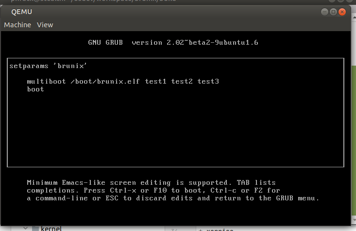

# brunix (stage 0)
### Small Unix-like 32-bits x86 OS for fun and learning

Before starting, please note that:
* the information here is complemented with that contained in the source code,
* with x86 we mean 386+ architecture.

### Goals

In this very first stage we are going to outline and depict the project structure. The idea is to do incremental
developments (stage0, stage1, ...) to tackle all the complexities in an easier way.

For now, we'll just create a bare OS (if we even can call it that way) that include:
* kernel loading (boot),
* basic video management.

## File structure

 * |── CMakeLists.txt ------> *CMake*'s build specification.
 * |── include/
   * |── *arch/x86/* -------> x86 architecture-dependent header files.
   * |── *brunix/* ----------> architecture-independent header files.
 * |── *kernel/* ----------------> kernel source code.
 * |── *libkern/* ---------------> custom [libc](https://wiki.osdev.org/C_Library) for the kernel.
 * |── *linker.ld.pp* ----------> linker script for preprocessing.
 * |── multiboot/ -----------> Multiboot booting related files.
 * |── bochsrc.txt ----------> config file for Bochs.
 * |── build/ -----------------> build dir for *CMake*. 

## Project building

Is is highly recommended to build the project on a directory other than the source directory. We assume *build/* as the build directory, but we can use whichever we want.\
__Any command that appears below is assumed to be run from the *build/* directory.__

After running:

	cmake ../
and then:

	make

from the shell, we will end up with:

 * |── build/ 
   * |── Makefile -------------> *make*'s build specification.
   * |── *brunix.elf* ------------> kernel's image.
   * |── System.map --------> kernel's symbol table. 
   * |── brunix.asm ----------> disassembled kernel's image.
   * |── brunix-nosym.elf ---> kernel's image without symbols/debug information.
   * |── brunix.iso ------------> bootable ISO image for the kernel.

## Build target

### Supported build commands

	make
(this is the default) buids the kernel's image,

	make qemu
runs the kernel's image on QEMU,
 
	make bochs
runs the kernel's image on Bochs,

	make clean
removes the generated kernel's image,

	make clean-all
removes all generated files but *make*/*CMake*'s own files.

### Behind the scenes

Please complement this section by looking at the "CMakeLists.txt" file.

#### 'default' target

Using the preconfigured GCC cross-compiler, it compiles all C and ASM ([GAS](http://wiki.osdev.org/GAS)) source code into [relocatable ELF object files](http://wiki.osdev.org/Object_Files) that
are linked together using ld (actually using GCC as a linker) into a conclusive statically linked executable ELF file:

    CMAKE_EXE_LINKER_FLAGS:   ${LDFLAGS} -Wl,-Map,${SYSTEM_MAP_NAME}
    CMAKE_C_LINK_EXECUTABLE:  ${CMAKE_C_COMPILER} <CMAKE_C_LINK_FLAGS> <LINK_FLAGS> -o <TARGET> <OBJECTS> -lgcc

The "-Map,System.map" option creates a file called "System.map" containing all the symbols from the ELF image.\
Regarding the "-lgcc" library inclusion, see [Libgcc](https://wiki.osdev.org/Libgcc).

#### *qemu* target

Runs QEMU emulator simulating that the OS image (brunix.iso, an ISO file) is inserted in the CD-ROM drive of a machine 
with 512 MiB of RAM memory:

	qemu-system-i386 -cdrom brunix.iso -m 512M

#### *bochs* target

Like *qemu*, but reading the configuration from the "bochsrc.txt" file.

	megs: 512
	ata0-slave:  type=cdrom, path="brunix.iso", status=inserted
    boot: cdrom

- -
We'll use [ELF](http://wiki.osdev.org/ELF) as the kernel image format, [ld](http://wiki.osdev.org/LD) linker from the
cross-compiler just built (see "[Pre-requisites](#Pre-requisites)" section above) to produce an ELF-formatted kernel image,
and [GRUB](https://wiki.osdev.org/GRUB) [bootloader](https://wiki.osdev.org/Bootloader) for booting the kernel.
- -

## Running the kernel

We can run it with:

	make qemu
	
or:

	make bochs

See #FAQs!

At boot time we can edit the boot parameters, like this:

After the system has booted up, something like this will appear:

## How do pieces play together?

### Kernel loading

Affected files:
* linker.ld.pp
* kernel/multiboot_entry_point.S
* kernel/multiboot.c
* kernel/main.c

Let's see what happen when we try to boot from  a CD containing a bootable ISO file:

##### Ancient ages

When the computer is turned on (see [Initialization](http://wiki.osdev.org/System_Initialization_(x86))), the CPU starts
in the so called Real Mode for compatibility reasons. In order to get all the power from an x86 CPU, we need to enable
the so called Protected Mode.\
So far, we have an ISO file containing both GRUB code (for booting) and the ELF kernel image.\
Once system initialization has been concluded, the ISO file is read from the CD-ROM drive and GRUB code gets executed.\
GRUB knows where the kernel is in the storage (see "iso/boot/grub/grub.cfg" file) and where to load it in physical RAM
memory for execution - 1 MiB, in this case - (see "linker.ld" file).
Just before jumping to the kernel, GRUB switches the CPU to Protected Mode with a full 4 GiB addressing space (32 bits),
and [Paging](https://wiki.osdev.org/Paging) and [Interrupts](https://wiki.osdev.org/Interrupts) disabled (more on this later).

### How is the brunix.iso file created?

When we run <i>"make"</i> or <i>"make compile"</i> (see "Makefile" file) from the project's top level directory, once
"brunix.elf" file gets created and put into "iso" directory, an ISO image is constructed with:

	grub-mkrescue -d misc/grub/i386-pc -o os.iso iso/

IMPORTANT: If you are working on an amd64 platform (as in my case) you need to provide the "-d" option to the command above.

## How does GRUB load the ELF-formatted kernel?

In order for GRUB to get the kernel loaded, it needs to know where in RAM
memory we want the kernel to be loaded, which is the entry point of the kernel,
and so on. It gets this information from the ELF headers contained in the
image. And the image
is created by the ld linker. (see linker.ld file)

## How does the kernel start running?
First thing first... our kernel image is ELF formatted and its inner structure is given by the ld linker directives and commands declared in the linker.ld file (see [Linker Scripts](http://wiki.osdev.org/Linker_Scripts)).
When GRUB (or any Multiboot-compliant bootloader, for that matter) loads our kernel image, it needs to check whether the kernel is Multiboot-compliant looking for certain values to be stored at the beginning of the kernel image; that's why we have a "multiboot_header" section (see [multiboot_entry_point.S](/kernel/multiboot_entry_point.S)) at the very first position in the linker.ld file.
Once GRUB has checked the image, it transfers the control to the kernel executing the code at the "_start" symbol.

### FAQ

#### Why ELF?

ELF is a very flexible, well supported and documented file format, that distinguish between TEXT, DATA and BSS sections.
Besides, ELF supports separate load and execution addresses, vital for a
[Higher Half Kernel](https://wiki.osdev.org/Higher_Half_Kernel) (more on this later).

#### Why GRUB?

GRUB, which adheres to the [Multiboot](http://wiki.osdev.org/Multiboot) specification, is very powerful and natively
supports loading ELF files.\
GRUB save us from all the pain of switching from [Real Mode](http://wiki.osdev.org/Real_Mode) to
[Protected Mode](http://wiki.osdev.org/Protected_Mode), as it handles all the unpleasant details. Also, GRUB helps us
avoid having to call [BIOS](https://wiki.osdev.org/BIOS) services.

#### Why both QEMU and Bochs?

QEMU is faster than Bochs and also integrates with GDB (more on this later), so it have its place as the regular emulator.
But, as the project evolves, it is a good idea to run it on Bochs from time to time given Bochs is way more accurate than 
QEMU on x86.\

TODO VER ESTO!!!!\
In other regards, Bochs don't support command line configuration and QEMU accept both command line configuration and
configuration file. We stick to the command line configuration for QEMU for debugging reasons: 

## NO STANDARD LIBRARY

In the kernel ... .. There's no standard library..!

## MULTIBOOT SPEC / GRUB

Aside,
EBX contains a pointer to the Multiboot information structure
EAX contains the value 0x2BADB002
Note that GRUB configures a stack but we can't trust its location, so we need to define ours.

TODO vEr esto: Since we haven't set up virtual memory yet, all virtual addresses are identical to the physical ones.

## Some considerations about GCC/GAS

* Default *includes* like `#include <stddef.h>` and `#include <stdint.h>` are __not__ from the [standard C library](https://wiki.osdev.org/C_Library) (we don't have one in kernel space) but from the compiler itself.
* In the context of including header files, we use the `__ASSEMBLER__` macro (like in `#ifndef __ASSEMBLER__`) to include C Preprocessor's structures on GNU assembler source files while ignoring any C code (like structs or unions) that would end up included by default.
* GCC's `__attribute__((packed))` is used to avoid paddings by the compiler: we need some structures' fields to be exactly on a particular location, at bit level.
* Note we don't use GCC's `__attribute__ ((noreturn))` for functions that don't return, like *panic()*: this is to avoid optimizations by the compiler that would play against debugging. We only mark those functions as NORET_FUNC (see [defs.h](/include/brunix/defs.h)) for informational purposes only.

##References:

* https://css.csail.mit.edu/6.858/2014/readings/i386.pdf
* https://wiki.osdev.org/Serial_Ports
* http://www.cse.iitd.ernet.in/os-lectures
* https://wiki.osdev.org
* https://wiki.osdev.org/Bare_Bones
* http://wiki.osdev.org/GCC_Cross-Compiler
* http://wiki.osdev.org/Why_do_I_need_a_Cross_Compiler%3F
* http://wiki.osdev.org/LD
* https://wiki.osdev.org/System_V_ABI (en duda)
* https://wiki.osdev.org/Calling_Conventions (en duda)
* http://wiki.osdev.org/System_Initialization_(x86)
* http://wiki.osdev.org/Memory_Map_(x86)
* //https://wiki.osdev.org/Interrupts
* //https://wiki.osdev.org/Non_Maskable_Interrupt
* http://wiki.osdev.org/Real_Mode
* http://wiki.osdev.org/Protected_Mode
* //https://wiki.osdev.org/Global_Descriptor_Table
* //https://wiki.osdev.org/Paging
* http://wiki.osdev.org/Printing_To_Screen
* http://www.brokenthorn.com/Resources/OSDevVga.html
* http://wiki.osdev.org/Multiboot
* https://www.gnu.org/software/grub/manual/multiboot/multiboot.html
* http://www.jamesmolloy.co.uk/tutorial_html
* http://www.osdever.net/bkerndev/index.php
* http://os.phil-opp.com/multiboot-kernel.html
* https://wiki.osdev.org/Inline_Assembly
* https://en.wikibooks.org/wiki/The_Linux_Kernel/System

https://pdos.csail.mit.edu/6.828/2014/readings/elf.pdf
https://pdos.csail.mit.edu/6.828/2014/readings/pcasm-book.pdf

https://gcc.gnu.org/onlinedocs/gcc-3.3/gcc/C-Extensions.html